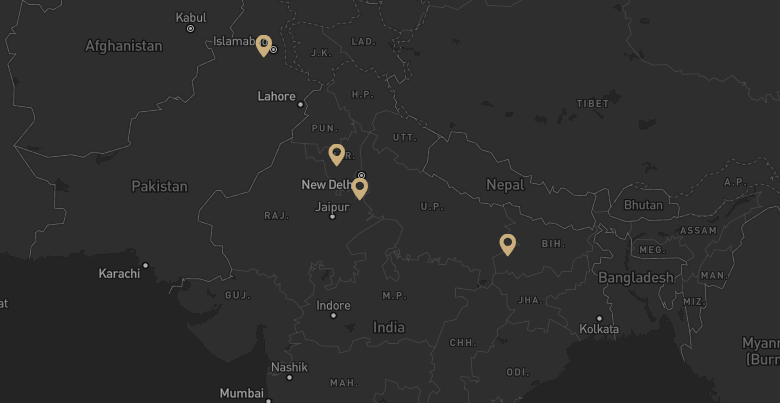
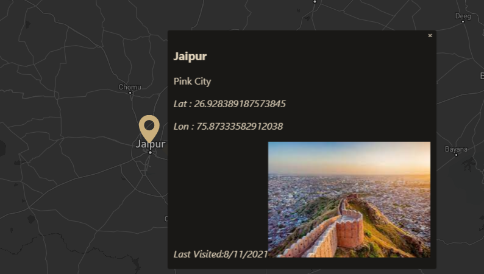

<h1>  Full Stack Travelling Log 🌍 🎡 ✈️<h1>

  <h3>This is a full stack application where you can log ✈️ your all  places 🗽🗼🚲 you have visited .... </h3>
   
  <h4> 🗺️🗺️🗺️Setting Up Enviornment 🛢️ ⌛ </h4>
  
<b> Starting Up Database server :</b> npm run dev 

  
<b> Starting Up React app :</b> npm start 

 
  
Intially::

   
  
Double click on any point where you visted  and form will be popped up

  
  
 Fill out the data and mark subimtted

    
  
 Data will be updated and pointer shown at that point

   
  
  
